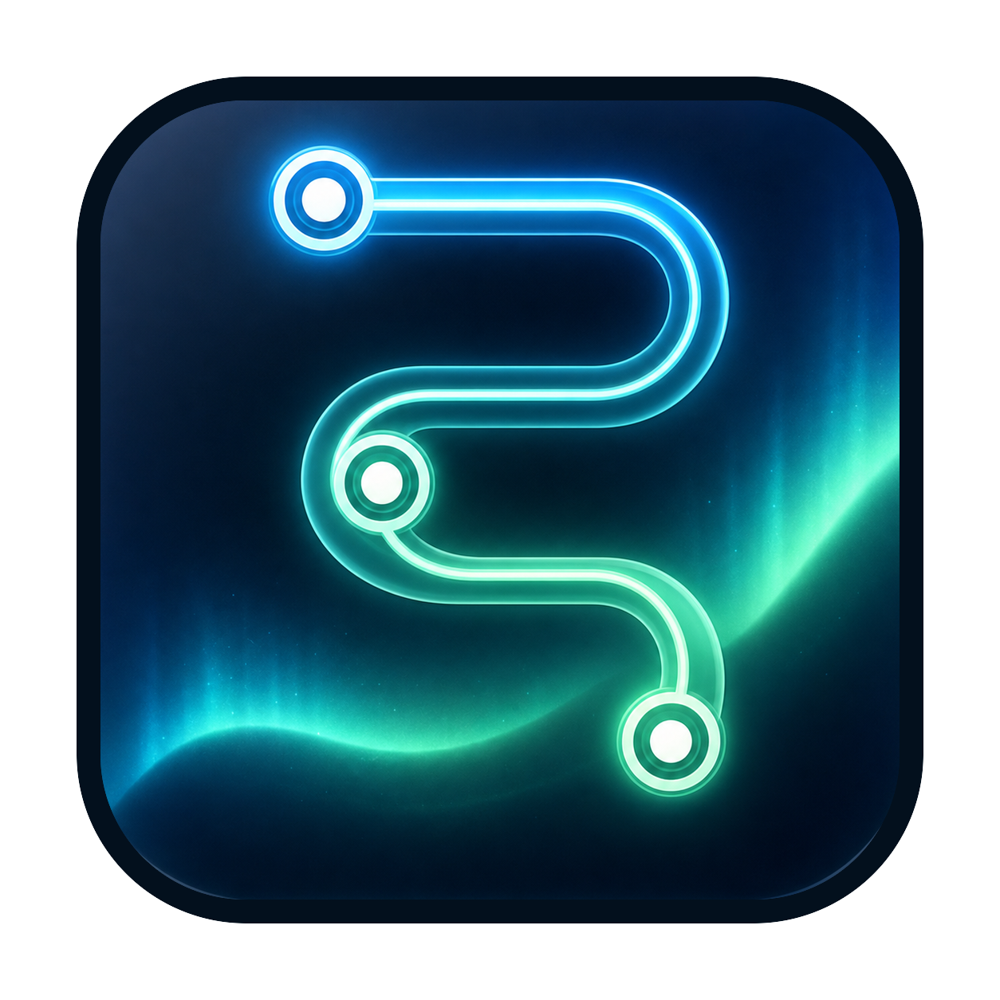

<p align="center">
  
</p>

<h1 align="center">SquadFlow</h1>

<p align="center">本地优先的 AI 智能体编排工作台</p>

<p align="center">
  <strong>中文</strong> · <a href="README.en.md">English</a>
</p>

<p align="center">
  <a href="LICENSE"></a>
  <a href="#安装"></a>
  <a href="#从源码运行"></a>
</p>

SquadFlow 是运行在本机的多智能体协作工作台。你描述目标、选择项目目录和模型；Leader 负责澄清、规划与协调，专家智能体分别承担实现、验证、评审和诊断。计划、关键决策和执行过程始终对你可见。

## 为什么使用 SquadFlow

- **把复杂工作组织成 Flow** — 一个 Flow 汇集目标、会话、计划、任务、工具调用和最终结果，可在重启后继续查看。
- **Leader 与专家协作** — Leader 将目标拆成可追踪的工作，并在需要时调度专长不同的专家，而不是把所有内容塞进一次对话。
- **人始终在回路中** — 通过计划审批、决策卡和后续消息调整方向；重要决定不被隐藏在后台。
- **选择自己的运行时** — 可使用 Codex、Claude 或兼容的自定义模型端点。模型和凭据由应用中的供应商管理配置。
- **使用项目原生上下文** — 在当前项目与本机范围内发现可用的 Skills 和 MCP；输入 `/` 即可筛选并选择它们。
- **看得见工具做了什么** — 工作台显示精确的 MCP 服务与工具名称、调用状态、参数和结果。MCP 提供图标时，会在当前 Flow 中显示该图标。
- **本地优先** — 会话、项目关联和应用设置默认保留在你的电脑上；应用不运营模型请求中转服务。

## 使用方式

1. **创建 Flow** — 选择项目目录，描述希望达成的结果，并选择要使用的模型。
2. **补充上下文** — 在输入框键入 `/`，按名称或描述筛选可用的 Skill 与 MCP；用方向键和 Enter 将选中项插入正文。
3. **审阅计划** — Leader 解释拆解与执行方向；在需要时通过决策卡确认、拒绝或补充约束。
4. **跟踪执行** — 查看专家进度、文件操作、浏览器活动和 MCP 工具结果；工具组可展开查看原始结果。
5. **继续协作** — 在同一 Flow 中追问、纠偏或追加任务。状态和聊天记录会持久保存。

## Skills 与 MCP

SquadFlow 复用当前 Flow 可用的原生上下文，而不是要求你为每个对话重新维护一份清单。

- **Skills**：项目范围的 Skill 优先于全局 Skill；选择后会以内联实体显示在输入框和聊天记录中。
- **MCP**：应用显示当前运行时成功连接的 MCP 工具。结果使用 MCP 的标准内容结构渲染文本、图片、资源链接和结构化数据；没有供应图标时使用默认 MCP 图标。
- **作用域**：新建 Flow 显示全局可用项；关联项目的 Flow 同时显示项目与全局项，并优先显示离项目更近的项。
- **安全边界**：MCP 可能启动本地进程、读写文件或调用外部服务。只启用你信任的本机和项目配置，并在使用前理解其权限与副作用。

选择项以标准 Markdown 链接保存，因此同一条用户消息可以在输入框、聊天记录和运行时之间一致地传递；页面只负责把已识别的 Skill/MCP 链接渲染为可读的内联实体。

## 数据与隐私

工作区信息、会话记录和应用设置默认保存在你的电脑上。连接云模型时，请求直接发送给你配置的模型服务商；发送的数据仍受该服务商的条款和数据政策约束。

安装版的可变数据位于：

```text
~/Library/Application Support/SquadFlow/
```

更新或替换 `.app` 不会覆盖该目录；删除 `.app` 也不会自动删除其中的数据。源码开发数据与安装版数据隔离，开发态数据写入仓库中被 Git 忽略的 `output/` 目录。

## 安装

从 [Releases](../../releases) 下载最新的 DMG，将 SquadFlow 拖入“应用程序”即可。当前正式构建面向 Apple Silicon Mac，其他平台尚未正式支持。

### 首次配置

首次启动不会自动创建模型供应商。点击 Leader 区域的“未配置”，然后在“智能体设置 → 供应商管理”中添加 Codex、Claude 或兼容端点。创建或打开 Flow 后即可选择该 Flow 使用的模型。

## 技术架构

| 层 | 技术与职责 |
| --- | --- |
| 桌面壳 | Electron：窗口、系统集成、更新、打包和内置运行时 |
| 界面 | Next.js + React：Flow、对话、决策卡、工具与浏览器工作台 |
| 本地服务 | TypeScript + Fastify：持久化、协议、权限与智能体编排 |
| 数据 | SQLite：本地 Flow、消息、任务与设置 |
| 智能体运行时 | Codex App Server、Claude Agent SDK 与兼容的自定义模型端点 |

## 从源码运行

需要 Node.js 22 与 npm 10：

```bash
npm run setup   # 从锁定文件安装各包依赖
npm run dev     # 启动本地服务、渲染层与 Electron 壳
```

常用命令：

| 命令 | 用途 |
| --- | --- |
| `npm run check` | 类型检查、lint 和全部测试 |
| `npm run build` | 构建生产版本服务与渲染层 |
| `npm run desktop:package` | 构建并验证未签名的本地 App、DMG 和更新 ZIP |
| `npm run desktop:smoke` | 使用隔离数据启动打包产物并执行冒烟验证 |

## 仓库结构

```text
apps/
  desktop/       Electron 主进程、打包、更新与内置运行时
  local-service/ 本地 Fastify 服务、持久化与智能体运行时
  renderer/      Next.js + React 界面
tests/acceptance/ 自然语言桌面验收用例
scripts/         仓库级安装与开发编排
```

提交改动前请运行 `npm run check`。涉及桌面壳、启动流程或打包的改动还应运行桌面打包与冒烟验证。

## 安全

安全问题请按 [SECURITY.md](SECURITY.md) 的方式私下报告，不要创建公开 issue。

## 许可证

代码以 [Apache License 2.0](LICENSE) 发布。随应用分发的第三方组件适用其各自条款，见 [NOTICE](NOTICE) 与 [THIRD_PARTY_NOTICES.md](THIRD_PARTY_NOTICES.md)。
