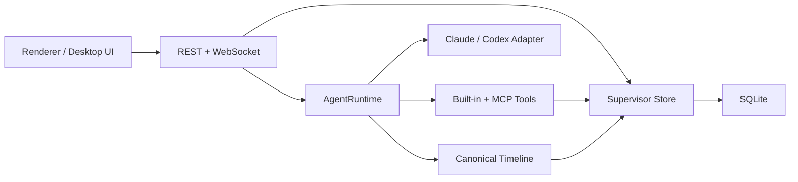

# Supervisor 系统设计

## 边界

- Flow 是归属边界，不是运行状态机。
- AgentSession 是身份和 provider 上下文；AgentRun 是技术执行。
- Runtime 只依赖统一 adapter，SDK 原始事件不进入产品领域模型。
- Canonical Timeline 是聊天唯一事实源；Snapshot 和增量事件投影同一数据库状态。
- Plan、Orchestration、Task、ChangeSet、Artifact 和各自审批保持独立生命周期，通过结构化引用展示。

## 数据不变量

1. 所有跨对象引用必须同 Flow、合法且可追溯。
2. 一个 Flow 只有一个 Leader Session；一个 Session 同时最多一个活跃 Run。
3. 终态 Run 和 ToolCall 不可复活，重复取消与重复审批幂等。
4. Task 状态只经显式 Task 工具改变；Run 与 Task 互不推导。
5. Task 依赖和编排节点依赖必须是无环图。
6. 待人工批准的编排版本不能提前创建 Task。
7. Artifact 必须有来源 Run；ChangeSet 文件必须来自真实触达证据。
8. 项目根、角色只读和工具权限属于硬边界，prompt 不能覆盖。

## clean-break 数据升级

数据库以事务升级为 Supervisor schema。若版本不匹配，保留 Project、全局设置和 Runtime 配置，删除旧 Flow 及其运行数据，再创建新表和索引。事务失败时保留升级前结构，不允许半新半旧。

核心表：`agent_definitions`、`agent_sessions`、`agent_runs`、`tool_calls`、`plan_documents`、`plan_revisions`、`plan_approvals`、`orchestration_plans`、`orchestration_revisions`、`orchestration_nodes`、`orchestration_approvals`、`tasks`、`task_dependencies`、`change_sets`、`change_set_contributions`、`change_set_files`、`decision_requests`，以及 Canonical Timeline 与队列表。

## 恢复

- 重启时活跃 Run 转为 `interrupted`，不留下旧 spinner。
- Queue、未读、Flow 模式、pending 用户动作、计划/编排历史和 Timeline 从 SQLite 恢复。
- ToolCall 权限等待只在同一进程/Run 内恢复；进程中断会拒绝其待处理权限。
- Snapshot 加后续 committed event 必须等价于最新数据库投影。
